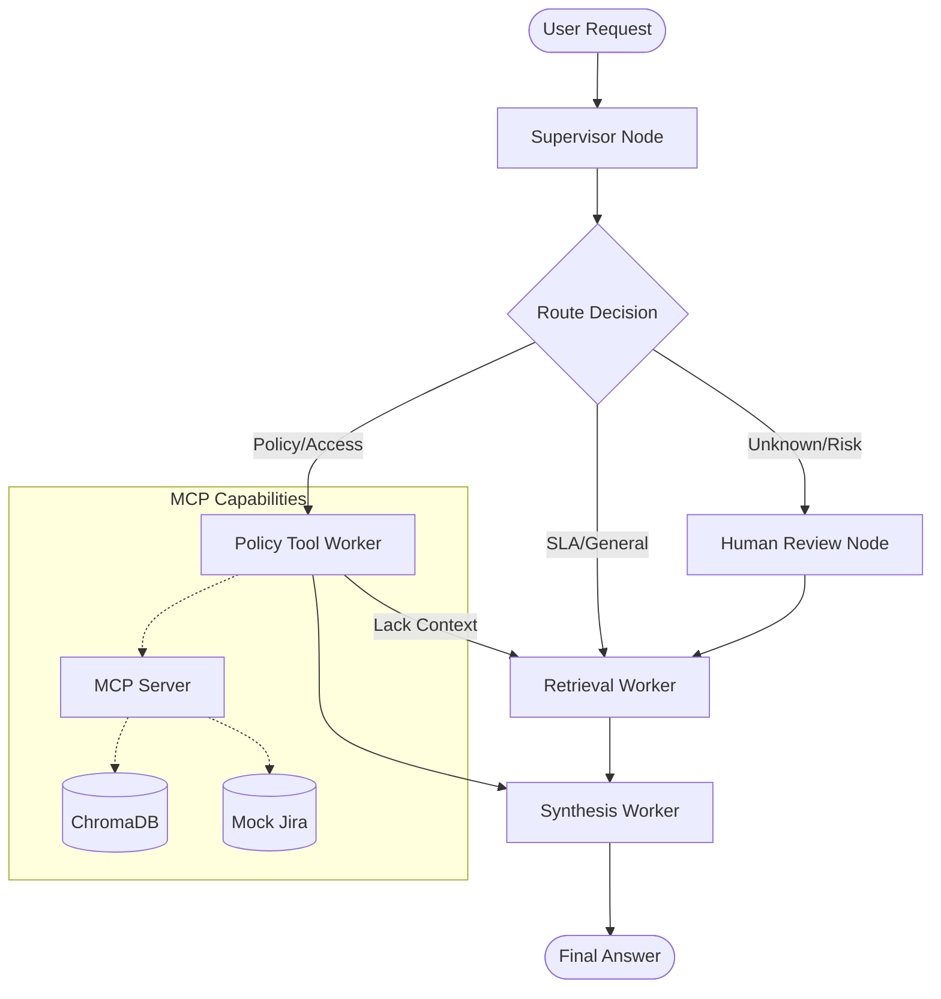

# System Architecture — Lab Day 09

**Nhóm:** AI in Action - Lab 09  
**Ngày:** 2026-04-14  
**Version:** 1.0

---

## 1. Tổng quan kiến trúc

Hệ thống được thiết kế theo pattern **Supervisor-Worker** để tối ưu hóa khả năng xử lý các yêu cầu phức tạp từ người dùng. Supervisor đóng vai trò là "bộ não" điều phối, phân loại intent của người dùng để gửi đến Worker chuyên biệt nhất, giúp tăng độ chính xác và khả năng trace lỗi.

**Pattern đã chọn:** Supervisor-Worker  
**Lý do chọn pattern này (thay vì single agent):**
1. **Tính modular:** Có thể phát triển và kiểm thử từng Worker (Retrieval, Policy, Synthesis) một cách độc lập.
2. **Khả năng quan sát (Observability):** Trace rõ ràng luồng đi của query, biết chính xác tại sao một quyết định được đưa ra.
3. **Mở rộng dễ dàng:** Có thể thêm các Worker mới hoặc tích hợp thêm MCP tools mà không cần thay đổi hoàn bộ hệ thống.
4. **Xử lý chuyên sâu:** Tách biệt logic tìm kiếm (retrieval) và logic kiểm tra chính sách (policy) để tránh nhầm lẫn.

---

## 2. Sơ đồ Pipeline

> Vẽ sơ đồ pipeline dưới dạng text, Mermaid diagram, hoặc ASCII art.
> Yêu cầu tối thiểu: thể hiện rõ luồng từ input → supervisor → workers → output.

**Ví dụ (ASCII art):**
```
User Request
     │
     ▼
┌──────────────┐
│  Supervisor  │  ← route_reason, risk_high, needs_tool
└──────┬───────┘
       │
   [route_decision]
       │
  ┌────┴────────────────────┐
  │                         │
  ▼                         ▼
Retrieval Worker     Policy Tool Worker
  (evidence)           (policy check + MCP)
  │                         │
  └─────────┬───────────────┘
            │
            ▼
      Synthesis Worker
        (answer + cite)
            │
            ▼
         Output
```

**Sơ đồ thực tế của nhóm:**



---

## 3. Vai trò từng thành phần

### Supervisor (`graph.py`)

| Thuộc tính | Mô tả |
|-----------|-------|
| **Nhiệm vụ** | Phân loại câu hỏi, trích xuất signal (keywords, risk) và chọn route. |
| **Input** | `task` (câu hỏi từ user). |
| **Output** | `supervisor_route`, `route_reason`, `risk_high`, `needs_tool`. |
| **Routing logic** | Keyword matching + Rule-based classification. |
| **HITL condition** | `risk_high` flagged (từ khóa emergency) + mã lỗi `err-`. |

### Retrieval Worker (`workers/retrieval.py`)

| Thuộc tính | Mô tả |
|-----------|-------|
| **Nhiệm vụ** | Tìm kiếm đoạn văn bản liên quan từ vector database. |
| **Embedding model** | `all-MiniLM-L6-v2` (Sentence Transformers). |
| **Top-k** | 3. |
| **Stateless?** | Yes. |

### Policy Tool Worker (`workers/policy_tool.py`)

| Thuộc tính | Mô tả |
|-----------|-------|
| **Nhiệm vụ** | Kiểm tra các quy tắc nghiệp vụ (Refund, Access) và gọi MCP. |
| **MCP tools gọi** | `search_kb`, `get_ticket_info`, `check_access_permission`. |
| **Exception cases xử lý** | Flash Sale, Digital Products, Probation Period, Emergency Access level 2/3. |

### Synthesis Worker (`workers/synthesis.py`)

| Thuộc tính | Mô tả |
|-----------|-------|
| **Nhiệm vụ** | Tổng hợp câu trả lời từ context, đảm bảo không có hallucination. |
| **LLM model** | `gemini-2.0-flash` (hoặc rule-based fallback). |
| **Temperature** | 0.1 (để đảm bảo groundedness). |
| **Grounding strategy** | Chỉ sử dụng thông tin trong `retrieved_chunks` và `policy_result`. |
| **Abstain condition** | Khi không tìm thấy chunk liên quan hoặc confidence < 0.3. |

### MCP Server (`mcp_server.py`)

| Tool | Input | Output |
|------|-------|--------|
| search_kb | query, top_k | chunks, sources |
| get_ticket_info | ticket_id | ticket details |
| check_access_permission | access_level, requester_role | can_grant, approvers |
| ___________________ | ___________________ | ___________________ |

---

## 4. Shared State Schema

> Liệt kê các fields trong AgentState và ý nghĩa của từng field.

| Field | Type | Mô tả | Ai đọc/ghi |
|-------|------|-------|-----------|
| task | str | Câu hỏi đầu vào | supervisor đọc |
| supervisor_route | str | Worker được chọn | supervisor ghi |
| route_reason | str | Lý do route | supervisor ghi |
| retrieved_chunks | list | Evidence từ retrieval | retrieval ghi, synthesis đọc |
| policy_result | dict | Kết quả kiểm tra policy | policy_tool ghi, synthesis đọc |
| mcp_tools_used | list | Tool calls đã thực hiện | policy_tool ghi |
| final_answer | str | Câu trả lời cuối | synthesis ghi |
| confidence | float | Mức tin cậy | synthesis ghi |
| ___________________ | ___________________ | ___________________ | ___________________ |

---

## 5. Lý do chọn Supervisor-Worker so với Single Agent (Day 08)

| Tiêu chí | Single Agent (Day 08) | Supervisor-Worker (Day 09) |
|----------|----------------------|--------------------------|
| Debug khi sai | Khó — không rõ lỗi ở đâu | Dễ hơn — test từng worker độc lập |
| Thêm capability mới | Phải sửa toàn prompt | Thêm worker/MCP tool riêng |
| Routing visibility | Không có | Có route_reason trong trace |
| ___________________ | ___________________ | ___________________ |

**Nhóm điền thêm quan sát từ thực tế lab:**

_________________

---

## 6. Giới hạn và điểm cần cải tiến

1. **Routing Logic:** Hiện tại dựa trên keyword đơn giản, có thể cải tiến bằng LLM Supervisor để hiểu ngữ cảnh sâu hơn.
2. **Context Managed:** State chưa tối ưu hóa việc truyền tin giữa các worker nếu có nhiều vòng lặp.
3. **Synthesis Fallback:** Bộ fallback logic còn đơn giản, cần cải thiện khả năng trích xuất thông tin cấu trúc hơn khi LLM không khả dụng.
4. **API Rate Limit:** Cần hệ thống quản lý quota LLM tốt hơn để tránh gián đoạn dịch vụ.
