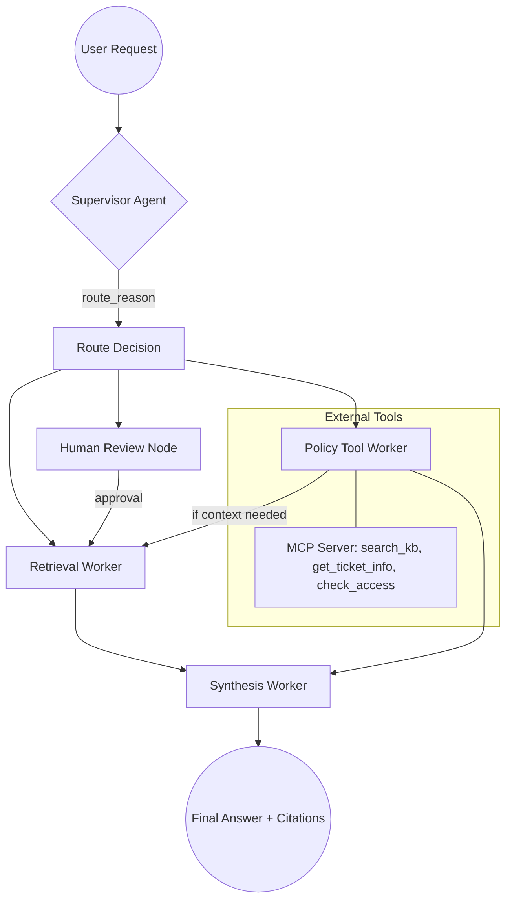

# System Architecture — Lab Day 09

**Nhóm:** Nhóm 04
**Ngày:** 2026-04-14
**Version:** 1.0

---

## 1. Tổng quan kiến trúc

Hệ thống được xây dựng theo kiến trúc **Supervisor-Worker**, sử dụng một thành phần điều hướng trung tâm (Supervisor) để phân tích câu hỏi người dùng và điều hướng đến các worker chuyên biệt (Retrieval, Policy Tool) trước khi tổng hợp câu trả lời (Synthesis).

**Pattern đã chọn:** Supervisor-Worker  
**Lý do chọn pattern này (thay vì single agent):**
- **Tách biệt trách nhiệm (Separation of Concerns):** Giúp quản lý logic phức tạp (tra cứu policy, kiểm tra quyền, truy vấn dữ liệu) dễ dàng hơn.
- **Khả năng quan sát (Observability):** Có thể theo dõi lý do chọn luồng xử lý (`route_reason`) và kiểm soát rủi ro (`risk_high`).
- **Khả năng mở rộng:** Dễ dàng thêm các worker mới hoặc tích hợp công cụ ngoài qua MCP mà không làm prompt chính bị quá tải.

---

## 2. Sơ đồ Pipeline

---

## 3. Vai trò từng thành phần

### Supervisor (`graph.py`)

| Thuộc tính | Mô tả |
|-----------|-------|
| **Nhiệm vụ** | Phân tích query, xác định luồng xử lý, đánh giá rủi ro và nhu cầu sử dụng tool. |
| **Input** | `task` (câu hỏi của user) |
| **Output** | `supervisor_route`, `route_reason`, `risk_high`, `needs_tool` |
| **Routing logic** | Dựa trên keyword (hoàn tiền, access, P1, SLA) và pattern (mã lỗi ERR-). |
| **HITL condition** | Khi phát hiện mã lỗi lạ (`ERR-xxx`) hoặc yêu cầu rủi ro cao mà thiếu context. |

### Retrieval Worker (`workers/retrieval.py`)

| Thuộc tính | Mô tả |
|-----------|-------|
| **Nhiệm vụ** | Truy vấn dữ liệu dense từ ChromaDB để cung cấp bằng chứng (evidence). |
| **Embedding model** | `text-embedding-3-small` (OpenAI) hoặc `all-MiniLM-L6-v2` (Offline). |
| **Top-k** | 3 (mặc định) |
| **Stateless?** | Yes |

### Policy Tool Worker (`workers/policy_tool.py`)

| Thuộc tính | Mô tả |
|-----------|-------|
| **Nhiệm vụ** | Xử lý các yêu cầu liên quan đến chính sách, hoàn tiền, cấp quyền sử dụng MCP tools. |
| **MCP tools gọi** | `search_kb`, `get_ticket_info`, `check_access_permission` |
| **Exception cases xử lý** | Hoàn tiền sản phẩm lỗi, Flash Sale, tài khoản bị khóa, cấp quyền Level 3. |

### Synthesis Worker (`workers/synthesis.py`)

| Thuộc tính | Mô tả |
|-----------|-------|
| **LLM model** | `gpt-4o-mini` hoặc tương đương. |
| **Temperature** | 0.0 (để đảm bảo tính chính xác và nhất quán). |
| **Grounding strategy** | Sử dụng numerical citations [1][2] dựa trên `retrieved_chunks`. |
| **Abstain condition** | Khi không tìm thấy evidence phù hợp trong chunks được cung cấp. |

### MCP Server (`mcp_server.py`)

| Tool | Input | Output |
|------|-------|--------|
| search_kb | query, top_k | chunks, sources |
| get_ticket_info | ticket_id | ticket details |
| check_access_permission | access_level, requester_role | can_grant, approvers |
| escalale_p1 | ticket_id, reason | escalation_status |

---

## 4. Shared State Schema

| Field | Type | Mô tả | Ai đọc/ghi |
|-------|------|-------|-----------|
| task | str | Câu hỏi đầu vào | supervisor đọc |
| supervisor_route | str | Worker được chọn | supervisor ghi |
| route_reason | str | Lý do route | supervisor ghi |
| retrieved_chunks | list | Evidence từ retrieval | retrieval ghi, synthesis đọc |
| policy_result | dict | Kết quả kiểm tra policy | policy_tool ghi, synthesis đọc |
| mcp_tools_used | list | Tool calls đã thực hiện | policy_tool ghi |
| final_answer | str | Câu trả lời cuối | synthesis ghi |
| confidence | float | Mức tin cậy | synthesis ghi |
| hitl_triggered | bool | Trạng thái Human-in-the-loop | supervisor/human_review ghi |

---

## 5. Lý do chọn Supervisor-Worker so với Single Agent (Day 08)

| Tiêu chí | Single Agent (Day 08) | Supervisor-Worker (Day 09) |
|----------|----------------------|--------------------------|
| Debug khi sai | Khó — không rõ lỗi ở giai đoạn nào | Dễ hơn — isolate được lỗi tại Retrieval hay Policy |
| Thêm capability mới | Phải sửa toàn bộ system prompt | Thêm worker chuyên biệt hoặc MCP tool |
| Routing visibility | Không có | Có minh chứng rõ ràng qua `route_reason` |
| Độ phức tạp logic | Bị giới hạn bởi ngữ cảnh hội thoại | Xử lý được luồng phức tạp (multi-hop) |

**Nhóm điền thêm quan sát từ thực tế lab:**
Trong quá trình chạy 15 câu test, hệ thống multi-agent xử lý rất tốt các câu hỏi phức tạp về chính sách hoàn tiền có điều kiện (ví dụ q12, q13) nhờ sự hỗ trợ của Policy Worker và reasoning của LLM trước khi truy vấn dữ liệu.

---

## 6. Giới hạn và điểm cần cải tiến

1. **Độ trễ (Latency):** Việc chạy qua nhiều bước (Supervisor -> Worker -> Synthesis) làm tăng latency so với single agent.
2. **Chi phí:** Nhiều lượt gọi LLM hơn (Supervisor cũng dùng LLM hoặc logic phức tạp).
3. **Dependency:** Nếu Supervisor route sai ngay từ đầu, cả pipeline sẽ cho kết quả sai. Cần cải thiện prompt cho Supervisor.

